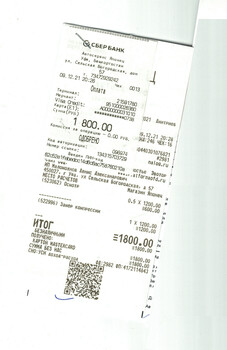
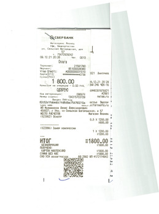
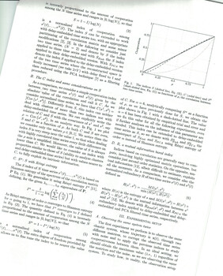
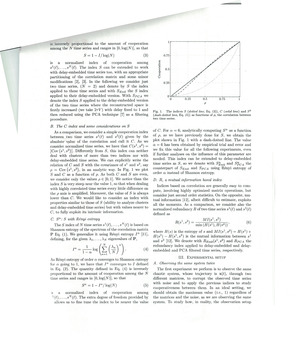
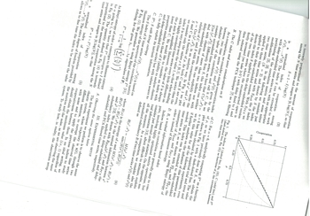
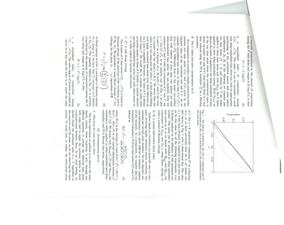
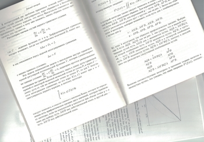
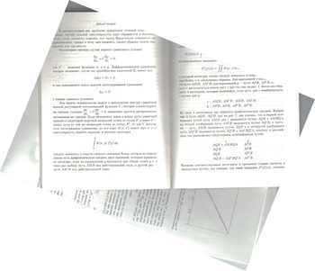
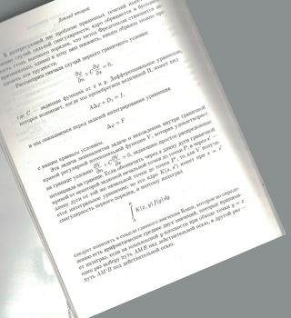
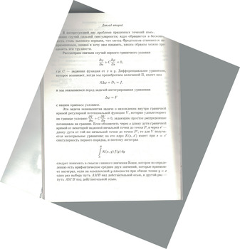

# Detecting the rotation angle of scanned documents

Detects the rotation of scanned documents.

Uses libleptonica

Designed for embedding in systems using tesseract OCR

[See usage examples](examples)

---

 `-->` 

 `-->` 

Original                  |  Rotated
:------------------------:|:-------------------------:
  | 
  | 
  | 

---

The detection algorithm based on [Rényi entropy](https://en.wikipedia.org/wiki/R%C3%A9nyi_entropy)

The proposed algorithm works quite well. However, it can be improved.

---
[The MIT License](LICENSE)
